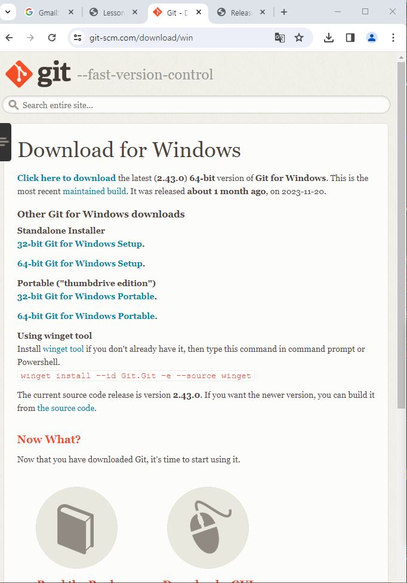

## Getting Started

Welcome to the VS Code Java world. Here is a guideline to help you get started to write Java code in Visual Studio Code.

## Folder Structure

The workspace contains two folders by default, where:

- `src`: the folder to maintain sources
- `lib`: the folder to maintain dependencies

Meanwhile, the compiled output files will be generated in the `bin` folder by default.

> If you want to customize the folder structure, open `.vscode/settings.json` and update the related settings there.

## Dependency Management

The `JAVA PROJECTS` view allows you to manage your dependencies. More details can be found [here](https://github.com/microsoft/vscode-java-dependency#manage-dependencies).

# 1 git 버전 관리
    
## 2 git 설치
[git-scm 다운로드](https://git-scm.com/)
## 3 github 원격 저장소 사용하기 
*[github 계정만들기]()
## 4 로컬 저장소 초기화
* Class231228 폴더 아래 Java 폴더를 초기화
{: width="10" height="10"}

## 5 원격저장소 등록하기 
###### 6
